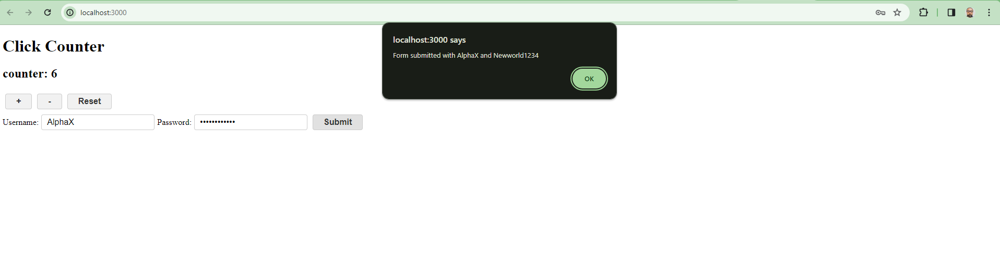
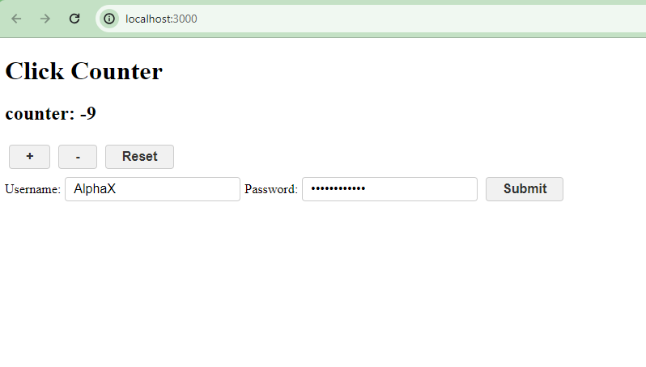

# Objective
The purpose of this assignment is to deepen the understanding of state management in React using the useState hook by building two components: 
- a counter that can increase, decrease, and reset its value. 
- a form that captures user input in a controlled manner. 

- This exercise will reinforce the concepts of stateful logic in functional components and demonstrate the power of React's reactivity system.

## Instructions
### Part 1: Counter Component
#### Create the Counter Component:

- In Next.js project's components directory, created a file named Counter.js.
- Implemented a counter with three buttons to increase, decrease, and reset its value.
#### Integrate the Counter in Your Application:

- Import and render the Counter component in your src/app/page.js file.
### Part 2: Controlled Form Component
Set Up the User Form Component:

- Created a new file named UserForm.js in the components directory.
Designed a form with text input fields for the username and password with a submit button. 
- The form displays the input value using an alert upon submission.
### Implemented Controlled Component Logic:

- Utilized the useState hook to manage the input field's state, ensuring the input is a controlled component.
- Included functions to handle changes to the input field and the form submission.
### Display the Form in the Application:

- Imported and included the Form component on the existing page.js page.
## Part 3: GitHub Repository Update
### Commited the Changes:
- Ensurde all changes were committed to  Git repository with descriptive commit messages.
## Pushed to GitHub
### Screenshot attached


### Counter showing negative count



## Getting Started

First, run the development server:

```bash
npm run dev
# or
yarn dev
# or
pnpm dev
# or
bun dev
```

Open [http://localhost:3000](http://localhost:3000) with your browser to see the result.

You can start editing the page by modifying `app/page.js`. The page auto-updates as you edit the file.

This project uses [`next/font`](https://nextjs.org/docs/basic-features/font-optimization) to automatically optimize and load Inter, a custom Google Font.

## Learn More

To learn more about Next.js, take a look at the following resources:

- [Next.js Documentation](https://nextjs.org/docs) - learn about Next.js features and API.
- [Learn Next.js](https://nextjs.org/learn) - an interactive Next.js tutorial.

You can check out [the Next.js GitHub repository](https://github.com/vercel/next.js/) - your feedback and contributions are welcome!
